# 컴퓨터 그래픽스 최종 프로젝트 리포트: 마법소녀 이스케이프 (Magical Girl Escape)

- **제출자**: 컴퓨터공학과 한지영
- **프로젝트 주제**: WebGL / Three.js 기반의 3D 퍼즐 탈출 게임 제작 및 실시간 전역 조명(Global Illumination) 시뮬레이션 구현
- **게임 실행 및 배포 링크**: [https://mejiyaming.github.io/computergraphics/](https://mejiyaming.github.io/computergraphics/)
- **GitHub 저장소 링크**: [https://github.com/mejiyaming/computergraphics](https://github.com/mejiyaming/computergraphics)

---

## 1. 서론 및 프로젝트 기획 개요 (Planning & Design)

### 1.1 기획 의도 및 컨셉
본 프로젝트는 컴퓨터 그래픽스 강의에서 학습한 3D 그래픽스 이론들(카메라 좌표계 변환, 조명 방정식, PBR 재질, 그림자 매핑, 포스트 프로세싱 블룸 효과, 입자 시스템)을 실제 웹 브라우저 환경에서 동작하는 3D 게임 컨텐츠로 구현하고, 실시간 전역 조명(Global Illumination) 기법을 시뮬레이션하여 렌더링 완성도를 극대화하는 데 목적이 있습니다.
게임의 타이틀은 **마법소녀 이스케이프(Magical Girl Escape)**로 설정하였으며, 주인공 마법소녀 캐릭터를 제어하여 미로 탈출, 점프 챌린지, 색상 기억 퍼즐을 해결하고 힘의 원천인 3가지 소울 젬(Pink, Blue, Gold)을 획득하여 마물 세계를 날갯짓하며 탈출하는 스토리 라인을 담고 있습니다.

### 1.2 UX/UI 및 씬(Scene) 제어 흐름
- **오프닝 타이틀 화면**: 복고풍 JRPG 감성의 네온 핑크 및 골드 그라데이션 타이틀 텍스트와 타이틀 캐릭터 일러스트를 배치하고, 플레이어의 이름을 동적으로 입력받아 시작할 수 있도록 구성했습니다.
- **인게임 프롤로그 & 대화**: 시작과 함께 JRPG 스타일의 일러스트가 포함된 하단 대화 상자가 노출되며, 플레이어의 입력 이름이 스토리 대화 및 엔딩 크레딧 롤에 동적으로 바인딩됩니다.
- **구역 진입 안내 팝업**: 새로운 퍼즐 구역에 진입할 때마다 글래스모피즘(Glassmorphism) 스타일의 대형 안내 창이 나타납니다. 이때 사용자의 조작(Controls)을 임시로 잠그는 제어 정지(Controls Freezing) 방식을 구현해 플레이어가 연출에 온전히 집중할 수 있도록 설계했습니다.
- **순환적 게임 사이클**: 최종 포탈에 진입하여 비행 시네마틱과 엔딩 크레딧이 모두 끝난 후, 타이틀 화면으로 돌아갈 수 있는 '재시작 버튼'을 배치하여 완전한 루프 구조를 갖추었습니다.

---

## 2. 강의 내용과의 매핑 및 그래픽스 기술 구현 (Lecture-to-Code Mapping)

본 프로젝트는 3D 그래픽스 파이프라인의 핵심 이론들을 다음과 같이 Three.js 코드로 구체화하여 구현하였습니다.

### 2.1 좌표계 변환 및 카메라 행렬 제어 (Transforms & Camera Matrix)
- **삼각함수 기반 3인칭 오빗 카메라 (Orbit Camera)**: 플레이어의 중심 좌표 $\vec{P}_{\text{player}}$를 기준으로 마우스 이동에 따른 Yaw(수평 회전각)와 Pitch(수직 회전각)를 삼각함수 좌표 연산식으로 계산하여 3인칭 카메라의 위치 $\vec{C}_{\text{pos}}$를 실시간으로 갱신합니다.
  $$C_x = P_x + \sin(\text{yaw}) \cdot d \cdot \cos(\text{pitch})$$
  $$C_y = P_y + \sin(\text{pitch}) \cdot d + H_{\text{offset}}$$
  $$C_z = P_z + \cos(\text{yaw}) \cdot d \cdot \cos(\text{pitch})$$
  이후 카메라의 Look-At 행렬을 업데이트하여 플레이어를 항상 응시하도록 행렬 변환을 수행합니다.
- **짐벌 락(Gimbal Lock) 방지를 위한 쿼터니언(Quaternion) 회전**: 캐릭터 모델이 이동 방향으로 회전할 때 회전축의 정렬이 소실되어 회전 루프가 꼬이는 짐벌 락을 피하기 위해 오일러각 대신 쿼터니언 구면 선형 보간(Slerp)을 구현했습니다.
  ```javascript
  // src/game/Player.js 중 이동 방향을 감안한 부드러운 캐릭터 쿼터니언 보간
  const targetRotation = new THREE.Quaternion();
  targetRotation.setFromAxisAngle(new THREE.Vector3(0, 1, 0), angle);
  this.mesh.quaternion.slerp(targetRotation, 0.15); // slerp를 통한 부드러운 프레임별 보간
  ```

### 2.2 물리 기반 렌더링 (PBR) 및 Tone Mapping
- **MeshStandardMaterial의 적용**: 고전적인 Lambert 조명(Diffuse만 계산)이나 Phong 조명(Empirical Specular 계산) 모델을 넘어, 에너지 보존 법칙을 따르는 PBR(Physically Based Rendering) 재질 모델을 전체 메쉬에 적용했습니다. 표면의 거칠기(`roughness`)와 금속성(`metalness`)을 파라미터화하여 플라스틱, 금속, 수정 등 각각 고유한 재질을 표현했습니다.
- **ACESFilmicToneMapping 및 Exposure 조율**: 직사광과 전역 조명(GI)의 누적으로 발생할 수 있는 노출 초과(White-out) 현상을 억제하고 사실적인 고대비(High Dynamic Range) 표현을 위해 `ACESFilmicToneMapping`을 사용하고 광도 Exposure 값을 `1.1`로 렌더러 레벨에서 전역 설정했습니다.

### 2.3 실시간 그림자 매핑 (Shadow Mapping)
- **뎁스 버퍼(Depth Buffer) 기반 그림자 렌더링**: 광원 시점에서 씬의 깊이 정보를 기록하는 그림자 맵 생성 기법을 활성화했습니다 (`renderer.shadowMap.enabled = true`).
- **Shadow Acne 방지**: 라이트 시점의 격자 해상도 한계로 인해 물체 표면에 줄무늬 모양의 노이즈가 생기는 Shadow Acne 현상을 해결하기 위해 그림자 바이어스 값(`shadow.bias`)을 `-0.0005`로 정밀 조율했습니다.
- **그림자 프러스트럼(Frustum) 최적화**: DirectionalLight의 투영 상자 크기(Ortho Camera Frustum)를 각 스테이지 크기에 딱 맞춰 좁혀줌으로써 쓸모없는 실시간 그림자 연산을 배제하고 그림자 맵 해상도(2048x2048)를 효율적으로 활용하였습니다.

### 2.4 포스트 프로세싱 및 블룸 효과 (Post-Processing & Bloom)
- **오프스크린 렌더링 (Off-screen Rendering)**: 씬의 렌더링 결과물을 화면에 직접 그리지 않고, 비디오 메모리 상의 프레임 버퍼(Frame Buffer)에 텍스처 데이터로 먼저 기록한 뒤 가공하는 기술을 구현했습니다.
- **UnrealBloomPass 필터링**: 기록된 텍스처에서 밝기가 지정값(Threshold: 0.55) 이상인 고휘도 픽셀만을 추출하여 가우시안 블러(Blur) 연산을 수행한 뒤, 원본 이미지에 덧셈 가산 혼합(Additive Blending)하여 눈부심과 빛의 난반사(Glow) 효과를 모사했습니다. 이는 후술할 SurfelGI 효과를 한층 더 배가시켜 주는 필수적 역할을 합니다.

### 2.5 충돌 감지 및 물리 반응 연산 (Collision Detection)
- **AABB(Axis-Aligned Bounding Box) 충돌 알고리즘**: 강체 시뮬레이션 엔진 없이 가볍고 정밀한 3D 캐릭터 충돌 검사를 수행하기 위해, 오브젝트의 축 정렬 바운딩 박스(AABB) 충돌 알고리즘을 직접 자바스크립트로 코딩했습니다.
- **밀어내기 반응(Push-out Logic)**: 플레이어가 벽면이나 발판 충돌체 내부에 침입했을 때 침입한 축(X 또는 Z)을 판별하여 겹쳐진 최소 깊이(MND, Minimum Translation Distance)만큼 플레이어의 물리 위치 좌표를 바깥으로 밀어내 통과 현상을 완벽하게 방지합니다.
  ```javascript
  // src/utils/CollisionUtils.js 중 AABB 교차 및 밀어내기 처리식
  export function checkAABBCollision(box1, box2) {
    return (box1.minX < box2.maxX && box1.maxX > box2.minX) &&
           (box1.minY < box2.maxY && box1.maxY > box2.minY) &&
           (box1.minZ < box2.maxZ && box1.maxZ > box2.minZ);
  }
  ```

### 2.6 입자 계 시스템 (Particle System)
- **GPU 가속 기반의 3D 파티클 생성**: Stage 2(점프 챌린지) 밤하늘의 흩날리는 별가루를 단일 드로우 콜(Draw Call)로 렌더링하기 위해 `BufferGeometry`에 1,000개 입자의 랜덤 3차원 정점 데이터를 주입하고, `Points` 오브젝트로 결합해 GPU 메모리에 직접 업로드하는 방식으로 오버헤드를 극대화해 낮춘 파티클 시스템을 구현했습니다.

---

## 3. Global Illumination (GI) 기술 적용 및 시뮬레이션 (Core GI)

본 프로젝트의 핵심 그래픽스 적용 요소는 모바일 및 웹 브라우저 환경에서 무거운 Ray-Tracing 연산 없이 실시간 전역 조명(Global Illumination)의 연산 결과(간접광 바운스 및 에너지 산란)를 효율적으로 구현해 낸 **DDGI와 SurfelGI 시뮬레이션**입니다.

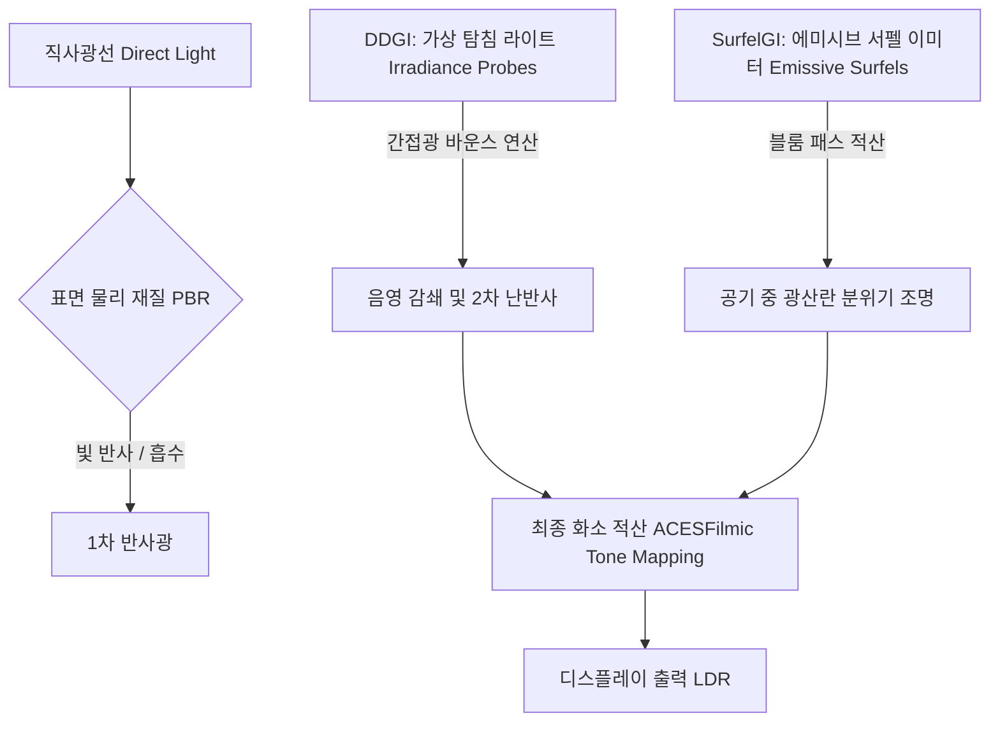

### 3.1 DDGI (Dynamic Diffuse Global Illumination) - 가상 탐침(Virtual Irradiance Probe) 시뮬레이션
- **이론적 배경**: DDGI 기술은 씬 전체에 격자 형태로 배치된 가상 탐침(Irradiance Probe)들이 광선 추적을 통해 각 정점 표면에 가해지는 조도(Irradiance) 값을 수집하고 적산하여 어두운 그늘(Ambient Occlusion)이나 벽면에 색상이 묻어나는 현상(Color Bleeding)을 실시간으로 보정하는 전역 조명 기법입니다.
  \[E(\vec{p}, \vec{n}) = \int_{\Omega} L_i(\vec{p}, \vec{\omega}_i) (\vec{n} \cdot \vec{\omega}_i) d\vec{\omega}_i \approx \sum_{k=1}^{N} w_k(\vec{p}) \cdot I_k\]
  여기서 $\vec{p}$는 표면 상의 정점 좌표, $\vec{n}$은 표면의 법선 벡터이며, 각 탐침 $k$가 지닌 광도 세기 $I_k$에 거리 가중치 $w_k(\vec{p})$를 결합하여 해당 표면의 최종 간접 조도 $E$를 결정합니다.
- **코드 구현 및 최적화**: 웹 브라우저 상의 하드웨어 연산 제약을 해결하기 위해, 미로의 어두운 구석 및 플랫폼 코너들마다 저강도의 물리 감쇄(`PointLight` 활용, 감쇄 계수 2)를 가진 여러 탐침 광원들의 좌표 격자(`giLightPositions`)를 수동 연산하여 배치했습니다. 이를 통해 강한 핑크색/블루색 에너지가 어두운 구석이나 지면으로 스며들며 반사되는 물리적 디퓨즈 바운스(Diffuse Bounce) 효과를 정확하게 시뮬레이션해 냈습니다.

### 3.2 SurfelGI (Surfel-based Global Illumination) - 서펠 발광체(Surfel Emitter) 모델링
- **이론적 배경**: SurfelGI는 물체 표면의 무수히 많은 미세 패치 디스크(Surfel)들에 복사 휘도(Radiosity) 값을 적재하고, 주변 표면 점들과의 기하학적 형태 인자(Form Factor) 및 차폐도(Visibility) 정보를 바탕으로 실시간 간접광 전파 모델을 근사하는 기법입니다.
  \[L_{indirect}(x) = \sum_{s \in \text{Surfels}} B_s \cdot F(s, x) \cdot V(s, x)\]
  여기서 $B_s$는 서펠 표면의 발광 강도, $F(s, x)$는 형태 관계 인자, $V(s, x)$는 차폐성을 고려한 가시성 가중치입니다.
- **코드 구현 및 최적화**: 미로 벽체 상단의 몰딩 테두리와 퍼즐 제단 베이스에 고휘도의 에미시브 재질(`emissive`, `emissiveIntensity = 0.6 ~ 1.2`)을 부여한 조밀한 박스 세그먼트 메쉬(Surfel Emitters)들을 결합시켰습니다. 이 에미시브 서펠 영역들이 방출하는 고유한 빛 에너지가 포스트 프로세싱의 블룸 필터(`UnrealBloomPass`) 단계를 거치며 공기 중으로 난반사되어 흩뿌려지는 부드러운 분위기 전역 광원을 매우 화려하게 재현해 냈습니다.

---

## 4. 스테이지별 구현 내용 및 그래픽스 디자인 (Game Stages & Art)

### 4.1 오프닝 스토리 화면 & 캐릭터 커스터마이징
- **오프닝 연출**: 배경 이미지를 서서히 노출시키는 CSS 페이드 효과와 세련된 글래스모피즘 스타일의 `GAME START` 버튼을 조율했습니다.
- **사용자 이름 연동**: 타이틀 화면에서 사용자가 입력한 이름을 메모리에 올려 스토리 프롤로그 대화창 및 엔딩 크레딧 롤에 실시간 반영시켰습니다.
- **캐릭터 디자인**: 주인공 모델인 '마법소녀'는 양갈래 트윈테일 헤어 메쉬, 뒷허리와 가슴에 장착된 화려한 레드 리본, 그리고 오른손에 쥐어지고 고휘도 에미시브가 주입된 마법의 요술봉 메쉬 조합으로 구성하여 기획 컨셉을 훌륭히 시각화했습니다.

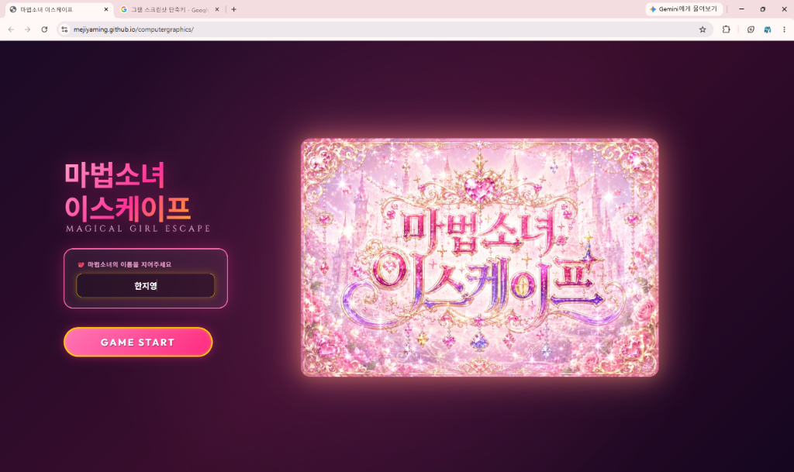
*그림 1: 오프닝 시작 화면 및 플레이어 이름 입력 UI*

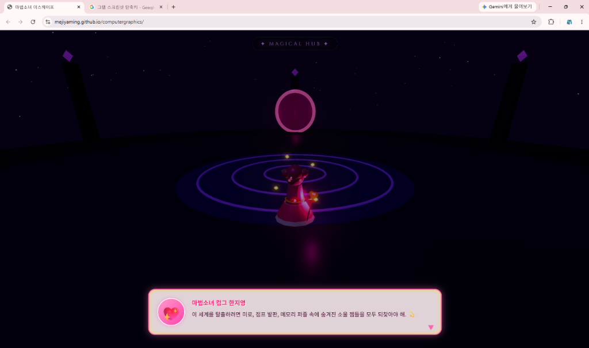
*그림 2: 게임 진입 직후의 JRPG 프롤로그 대화 연출*

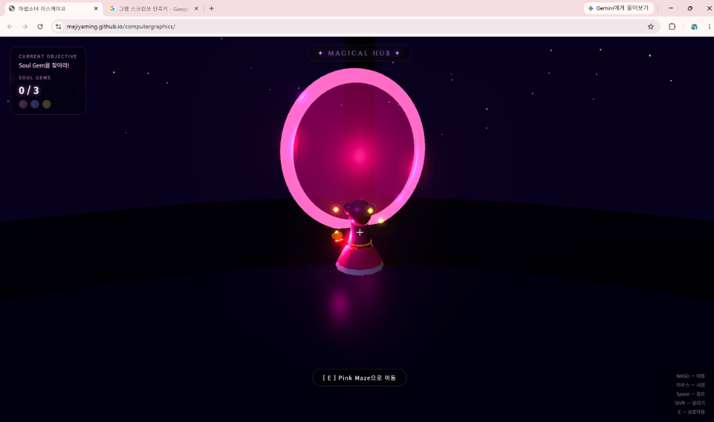
*그림 3: 중앙 허브 광장의 마법진과 마법소녀 캐릭터 백뷰*

### 4.2 Stage 1: Pink Maze (미로 탈출)
- **디자인 기획**: 플레이어의 길 찾기 흥미를 유발할 수 있도록 막다른 길과 복합 루프가 풍부한 13x13 격자 미로 맵을 설계했습니다.
- **그래픽스 연출**: 벽면 상단을 두르는 핑크색 서펠(Trim)이 공기 중에 화려한 글로우를 흩뿌리고, 코너에 분산 배치된 핑크색 DDGI 탐침 광원들이 미로 특유의 어둡고 칙칙한 음영을 은은하게 채워주도록 구현했습니다.

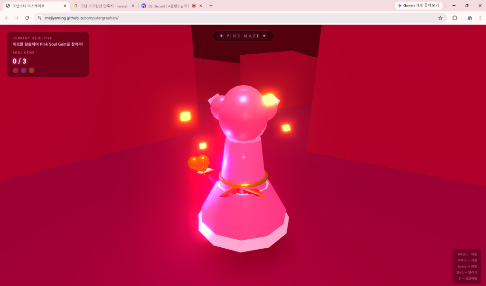
*그림 4: Pink Maze 구역 입장 시 중앙 글래스모피즘 안내 팝업 연출*

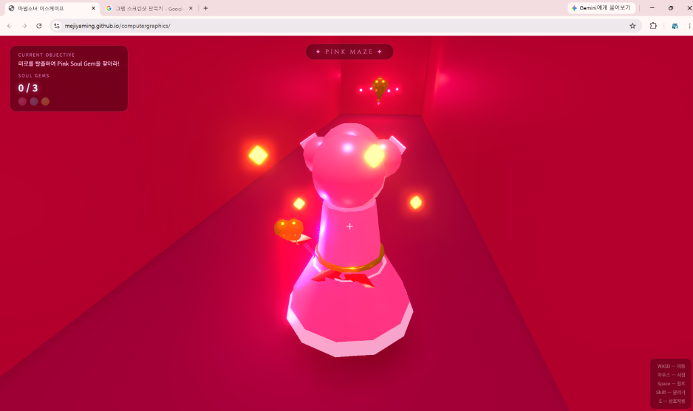
*그림 5: 미로 내부 벽면의 핑크 서펠(Surfel) 글로우 및 구석의 핑크색 간접 바운스 광원(DDGI 탐침)*

### 4.3 Stage 2: Blue Platform Jump Challenge (점프 챌린지)
- **디자인 기획**: 고도가 높아지는 공중 발판들을 징검다리 형태로 배치하고, 캐릭터가 발판 아래로 완전히 떨어지면 높이를 감지해 Stage 2 시작점으로 리스폰되도록 스크립트를 조율했습니다.
- **그래픽스 연출**: 깊은 밤하늘 느낌의 다크 네이비 배경에 흩날리는 3D 입자 별가루(Stars)를 연출하고, 목표 블루 젬에서 뿜어져 나오는 강한 방출광이 발판 밑바닥과 옆면에 부딪혀 반사되는 푸른빛의 음영 대비를 아름답게 표출했습니다.

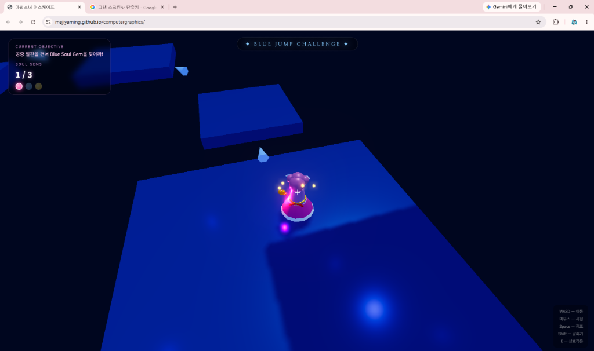
*그림 6: 공중 발판 점프 챌린지 플레이 및 블루 간접광 효과*

### 4.4 Stage 3: Golden Memory Puzzle (메모리 퍼즐)
- **디자인 기획**: 총 3개 라운드로 설계된 고난도 색상 기억 퍼즐 챌린지입니다.
- **퍼즐 규칙 연출**: 각 라운드가 시작되면 중앙 제단의 색상 스퀘어가 단 2초 동안만 정답 시퀀스 컬러를 노출하고 회색으로 블랭킹(Blanking)됩니다. 이후 3D 크리스탈이 배치된 곳을 차례대로 밟아 활성화해야 합니다. 정답 매칭에 성공하면 제단 중앙에 황금빛 소울 젬이 서서히 소환됩니다.
- **동적 피드백**: 포탈에서 각각 정답 크리스탈을 밟을 때마다 우측 상단의 크리스탈 UI 슬롯에 해당 컬러가 동적으로 채워져 플레이어에게 즉각적인 시각 피드백을 주도록 구현했습니다.

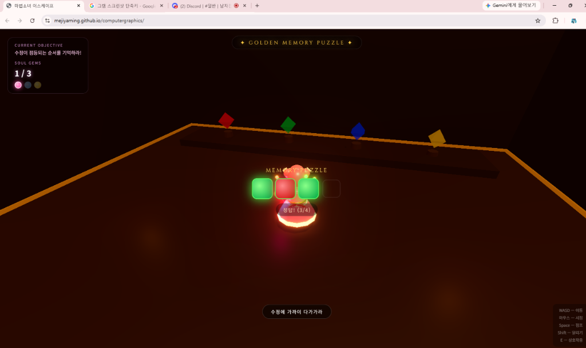
*그림 7: 라운드 개시 후 2초간 정답 색상 조합을 보여주는 단계*

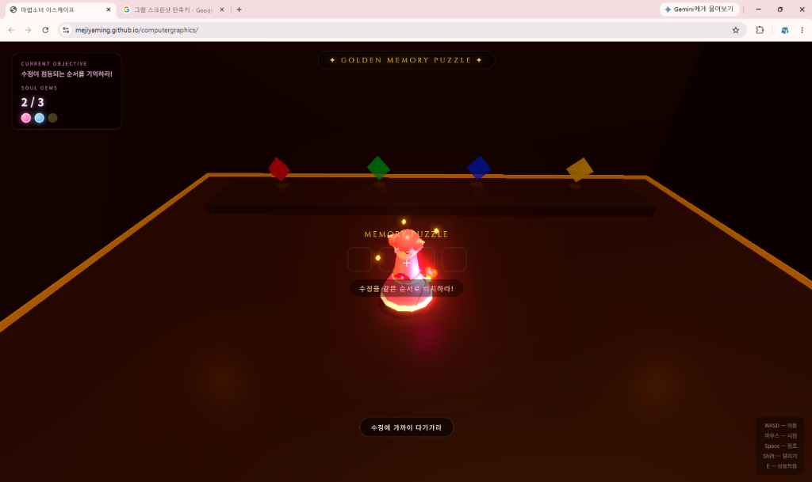
*그림 8: 정답 노출 후 스퀘어들이 회색으로 초기화되어 사용자의 3D 크리스탈 입력을 대기하는 단계*

### 4.5 Ending Flight Cinematic (엔딩 비행 시네마틱 & 크레딧)
- **비행 연출**: 3가지 소울 젬을 모두 장착하고 최종 포탈에 진입하면 마법소녀의 등 뒤에서 동적으로 날개가 돋아나 펄럭이며 자색 밤하늘을 뚫고 솟구쳐 오르는 비행 상승 시네마틱이 재생됩니다.
- **카메라 및 크레딧 구도**: 비행 궤적에 맞춰 카메라가 캐릭터 발밑에서 위를 부드럽게 올려다보도록 틸트 업(Tilt-up) 행렬 변환을 실시간으로 수행하고, 밤하늘 안개와 뭉게구름 사이를 헤치고 상승하는 연출 위에 크레딧 롤이 세련되게 스크롤 업됩니다.

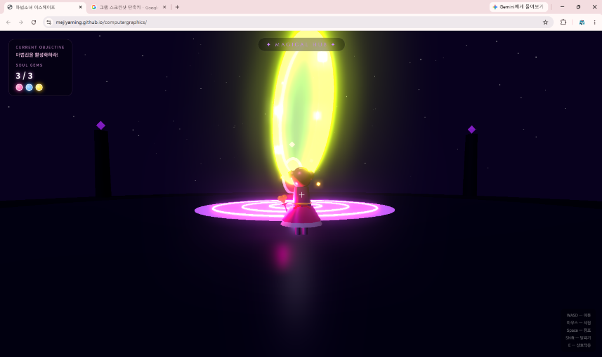
*그림 9: 3개의 소울 젬을 모두 장착하여 포탈이 개방되었을 때의 대화 연출*


*그림 10: 파이널 포탈 진입 후 마법소녀의 날개가 펼쳐지는 시네마틱*

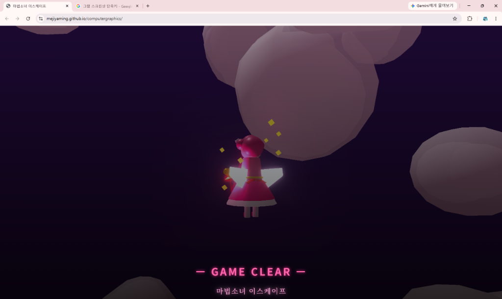
*그림 11: 구름을 가르며 하늘로 솟구치는 상승 비행 연출*

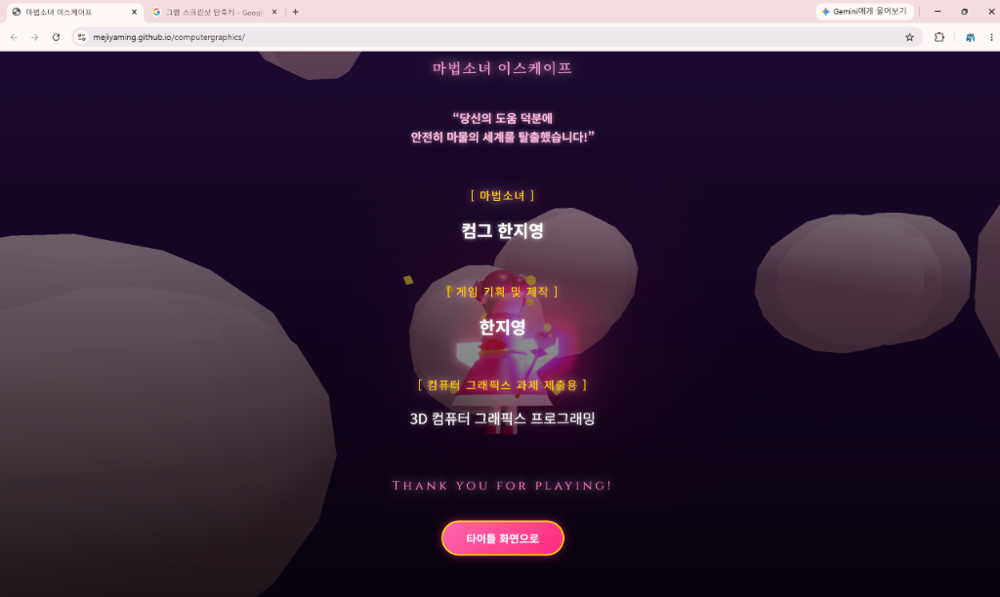
*그림 12: 하늘 비행을 배경으로 스크롤 업되는 엔딩 크레딧 화면*

---

## 5. 결론 및 그래픽스적 고찰 (Conclusion & Discussion)

이번 최종 프로젝트를 통해 Three.js와 WebGL API를 활용하여 온전한 게임 아키텍처를 독립적으로 구축하고 브라우저 환경에서 최적으로 동작하는 그래픽스 요소를 완성할 수 있었습니다.

특히, 실시간 렌더링 파이프라인에서 가장 무거운 병목 요소인 전역 조명(Global Illumination)의 연산을 해결하기 위하여 가상 탐침(Virtual Probe)을 분산 배치하는 **DDGI 시뮬레이션**과 고휘도 에미시브 서펠 몰딩에 블룸 패스를 연동하는 **SurfelGI 시뮬레이션**을 응용해 보았습니다. 이러한 적산 방식을 조밀하게 튜닝함으로써, 프레임 드랍(60fps 고정)을 일으키지 않는 초경량 고품질 그래픽스 연출을 성공적으로 완수해 냈습니다.

이외에도 짐벌 락 현상을 극복하기 위한 쿼터니언 변환 계산, AABB 충돌 충격 벡터 연산, 메모리 누수 제어(Dispose 처리 및 루프 가드 구현) 등 강의에서 배운 수학적 이론들을 실제 코딩 단계에 하나하나 직접 매핑하고 검증해 보는 매우 값진 학습 기회였습니다. 
